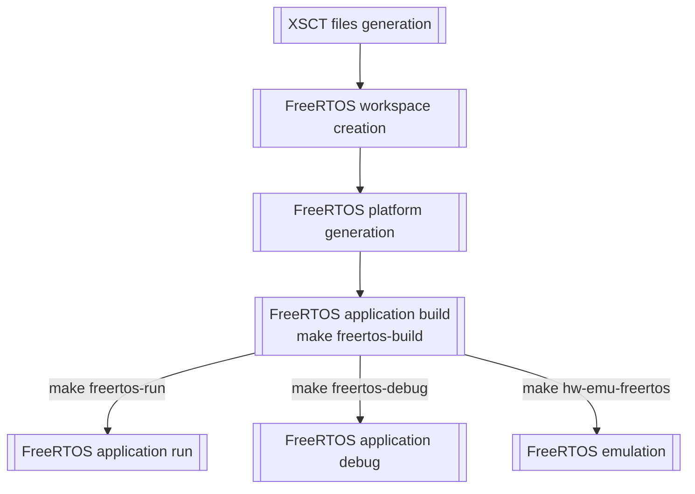

# FreeRTOS targets

Overview
----


Creating FreeRTOS projects
----
Creating a FreeRTOS project is done by adding a folder in the `freertos` folder:
```bash
mkdir -p freertos/<your project name>
cp <path to project src directory>/* freertos
```

Building a FreeRTOS project:
----
```bash
make freertos-build BM_PROJECT=<name of your project>
```

Opening minicom to display logs from uart serial interface
----
Ensure that the board serial interface (UART) is connected to your computer. Then open minicom (in a new terminal):
```bash
minicom -b 115200 -D /dev/ttyACM<N>
```
`N` is often 0 (check in your `/dev` folder).

Running project on board in non-interactive mode
----
```bash
make freertos-run FREE_RTOS_PROJECT=<name of your project>
```

Running project on board in interactive mode (debug mode)
----
```bash
make freertos-debug FREE_RTOS_PROJECT=<name of your project>
```
Refer to the following links to use interactive mode
- [XSCT runtime commands](https://www.xilinx.com/html_docs/xilinx2018_1/SDK_Doc/xsct/running/reference_xsct_running.html)
- [XSCT breakpoints commands](https://www.xilinx.com/html_docs/xilinx2018_1/SDK_Doc/xsct/breakpoints/reference_xsct_breakpoints.html)
- [XSCT memory commands](https://www.xilinx.com/html_docs/xilinx2018_1/SDK_Doc/xsct/memory/reference_xsct_memory.html)
- [XSCT register commands](https://www.xilinx.com/html_docs/xilinx2018_1/SDK_Doc/xsct/registers/reference_xsct_registers.html)

Executing Vitis in gui mode
----
Vitis
```bash
make vitis
```

Hardware emulation with FreeRTOS application using XSIM and QEMU
----
```bash
make hw-emu-freertos FREE_RTOS_PROJECT=<FreeRTOS project> SIM_MODE=<gui|cli>
```
Launch hardware emulation.

Default value for `SIM_MODE`: `gui`

Cleaning FreeRTOS workspace
----
```bash
make freertos-clean
```

